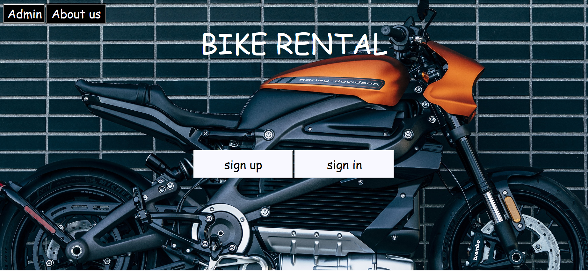
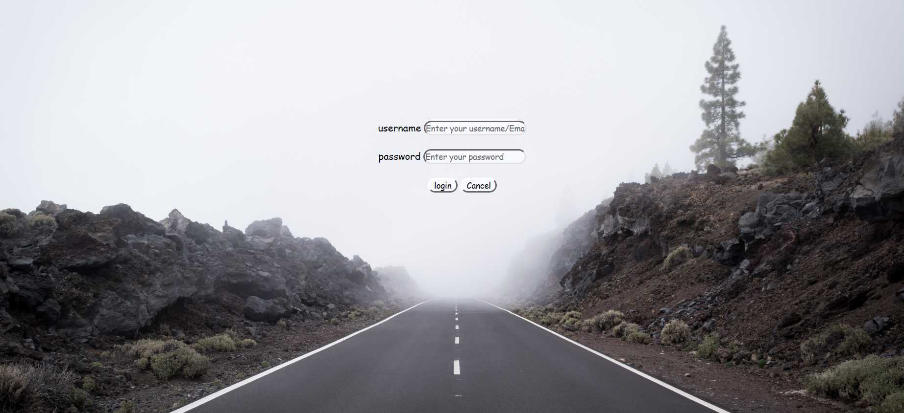
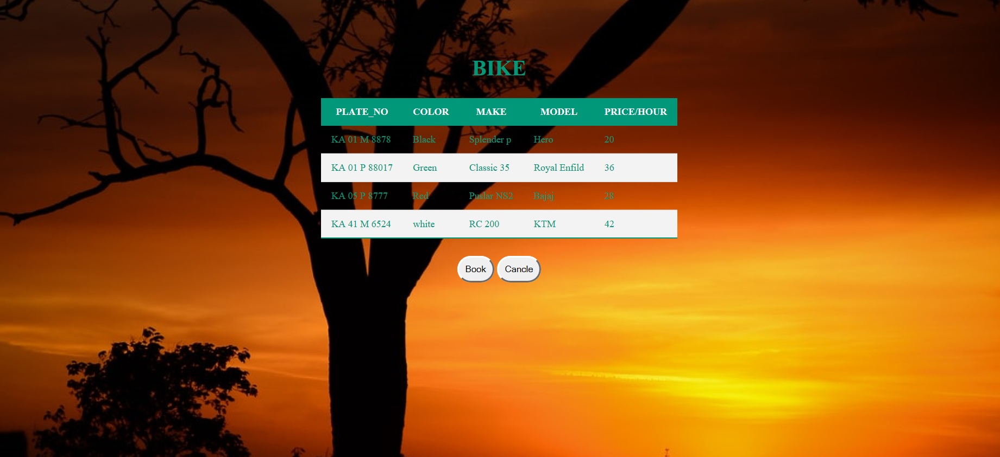
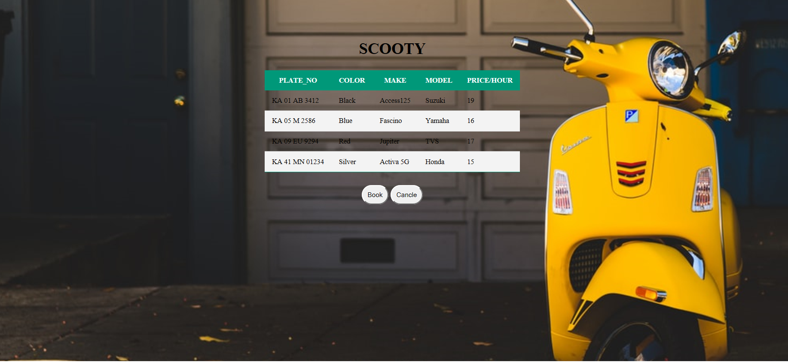
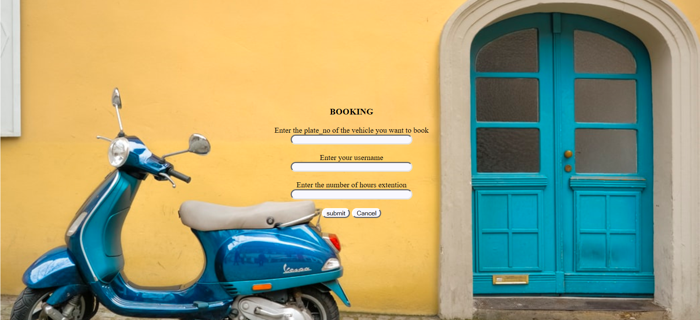

                 Bike-Rental-Database-Management-System

# Bike-Rental-Database-Management-System
A simple, full-stack web application to rent bikes online.

### Home Page

### Sign up Page

### Sign in Page

### Admin management page

### Gear bike selection page

### Without gear bike selection page

### Booking page 

### Payment page

### Booking page 

## Refer Description.md for tech stack used and steps to run the project  
